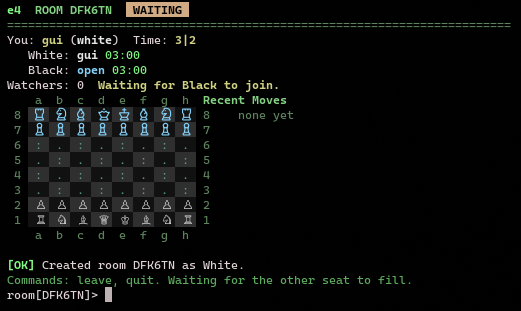

# e4

`e4` is a chess server for the terminal.

You run the server, connect over SSH, pick a nickname, and play or watch games.



## What It Does

- serves chess over SSH
- lets players create, join, and watch games
- supports time controls like `10|0`, `3|2`, and `15|10`
- accepts SAN moves like `e4`, `Nf3`, `O-O`, and `Qxe5+`
- shows a live board, clocks, and move list in the terminal
- includes built-in themes (`classic`, `mono`, `nightowl`)
- adapts the board and chrome to smaller SSH terminals

## Quick Start

Run Postgres and the server:

```bash
docker compose up --build
```

Or run the server against an existing Postgres database:

```bash
E4_DATABASE_URL='postgres://e4:e4@localhost:5432/e4?sslmode=disable' \
  go run ./cmd/e4 serve --listen :2222 --log-level debug
```

Connect from another terminal:

```bash
ssh -p 2222 anything@localhost
```

The SSH username is ignored. Player identity is tied to your SSH public key, and you choose a nickname after connecting.

Install the binary with:

```bash
go install github.com/morum/e4/cmd/e4@latest
```

Then run:

```bash
e4 serve
```

## Using The TUI

After you connect, type a nickname and press `Enter`.

### Lobby

The lobby is key-driven:

- `↑/↓` or `j/k`: move through rooms
- `Enter`: join the selected room, or watch it if no seat is open
- `w`: watch the selected room
- `c`: create a room, then enter a time control like `10|0`
- `r`: refresh the room list
- `t`: cycle to the next theme
- `?`: toggle help
- `q` or `ctrl+c`: quit

### Room

When the move input is focused, type SAN moves directly: `e4`, `Nf3`, `O-O`, `Qxe5+`.

Room controls:

- `Enter`: submit the current move or slash command
- `Esc`: toggle input focus
- `l`: leave the room and return to the lobby
- `ctrl+r`: resign
- `f`: flip the board
- `t`: cycle to the next theme
- `?`: toggle help
- `ctrl+c`: quit the SSH session

Slash commands typed into the input:

- `:leave` or `:quit`: leave the room
- `:resign`: resign the game
- `:flip`: flip the board
- `:theme <name>`: switch to a specific theme

## Configuration

```bash
e4 serve [--listen :2222] [--host-key ./.e4_host_key] [--log-level info] [--theme classic] [--database-url postgres://...]
```

Flags:

- `--listen`: SSH bind address
- `--host-key`: path to the SSH private host key file
- `--log-level`: `debug`, `info`, `warn`, or `error`
- `--theme`: default TUI theme (`classic`, `mono`, or `nightowl`)
- `--database-url`: Postgres connection URL. Can also be set with `E4_DATABASE_URL`

By default, `e4` stores its generated host key in `.e4_host_key`.
Postgres is required for persistent player identities, games, and move history.

## Project Layout

```text
cmd/e4                  CLI entrypoint
internal/app            app wiring and configuration
internal/domain         core game and lobby types
internal/service        room and lobby services
internal/store/memory   live in-memory room directory
internal/store/postgres persistent Postgres repositories and migrations
internal/clock          chess clock state
internal/tui            Bubble Tea models, widgets, and themes
internal/transport/ssh  SSH transport and session handling
```

The code is structured so persistence, ratings, chat, bots, tournaments, and other clients can be added later without replacing the core game flow.

## Development

Requirements:

- Go `1.25+`
- an SSH client

Common commands:

```bash
go test ./...
go build ./...
go run ./cmd/e4 serve --listen :2222 --log-level debug
```

## Contributing

See [`CONTRIBUTING.md`](./CONTRIBUTING.md).

## License

`e4` is released under the [MIT License](./LICENSE).
